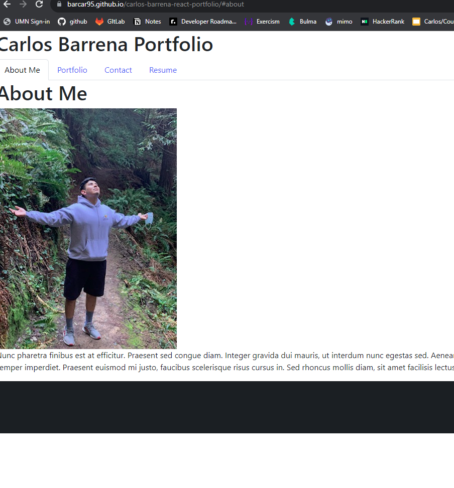

# Carlos Barrena React Portfolio
  
## Description
  This is my portfolio webpage that was created using React technology. It is a webpage where I can share information about myself and display my work.

## Table of Contents (Optional)
 
  - [Usage](#usage)
  - [License](#license)
  - [Questions](#questions)
    
## Usage
  This webpage should be used as reference to my skills by looking at the functionalities involved with the portfolio. It is to show my ability to use React technologies and other technologies used in my projects.

  
  
## License
  MIT License
  A short and simple permissive license with conditions only requiring preservation of copyright and license notices. Licensed works, modifications, and larger works may be distributed under different terms and without source code.
    
  
  [MIT Link](https://tlo.mit.edu/learn-about-intellectual-property/software-and-open-source-licensing)

## Questions
  If you have any questions reach out to my email barrenac95@gmail.com or my github https://github.com/barcar95.
  